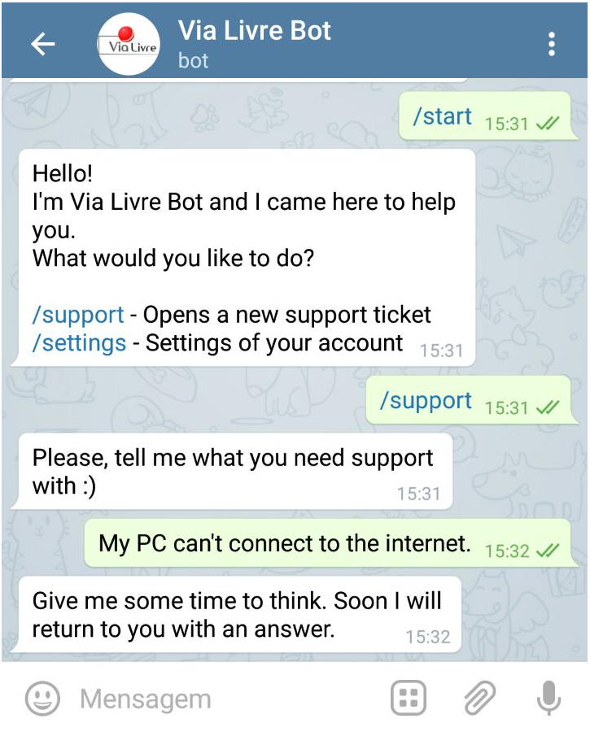
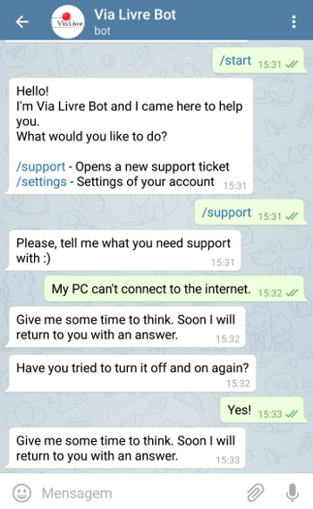

# HelpDesk Bot
> A Python Telegram Bot that works as a helpdesk software.

When a client sends a support message to the bot, it forwards the message to you or your company's group and you can reply it. Replying the message makes the bot reply the client.

1. The client talks to the bot.  


2. The company receives the message and replies it.  


3. The client receives the answer and the process continues.  


# Installation

1. Install the requirements

```
    $ pip install -r requirements.txt
    $ sudo apt-get install redis-server
```

2. Setup your bot token and the chat to which it will forward messages in the `config.ini` file.

3. Run the redis-server

```
    $ redis-server
```

4. In another instance, open the Python shell and run:

```
    from main import updater
    updater.start_polling()
```

As long as you want your bot responding, keep this running. When you want to stop, just run:

```
    updater.stop()
```

**PS:** Keep in mind that you will have to generate the locale `.mo` files.

# Contribute
Copyright (C) 2016 Júlia Rizza & licensed under MIT License
